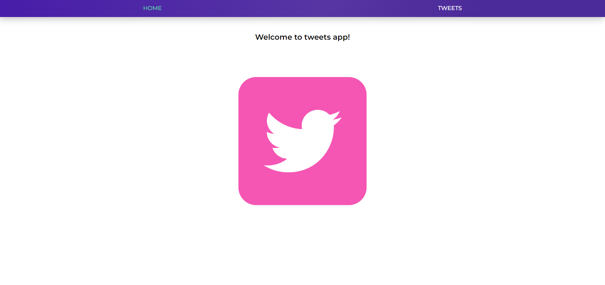
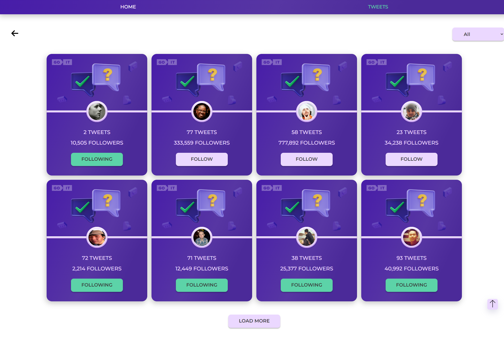

## Twitter cards with interactivity, a quiz with a tweet card image, and two "Home" and "Tweets" pages.

## A live version is available via the link in the About section.

### Application Description:

This project is about creating cards with interactivity as a test task that changes the state of the card when the Follow button is clicked. The design of the map is based on the provided layout, and the interactivity is implemented using JavaScript.

### Home page



### Tweets page



### Application functionality:

- When you click on the button in the card, the color and text of the button change. A request is made to update user data on mockapi. To simulate tracking the user who interacts with the cards, redux-persist is used, where the values of the selected cards are stored.

- Pagination is implemented to display a limited number of cards per page, and the "Load more" button is used to display the next batch of cards.

- There is a filtering of cards by status in the select: all cards, cards for which we have subscribed, and cards for which we have not subscribed.

- The tweets page has an arrow to return to the home page.

- On the home page, the picture is a link that takes you to the Tweets page.

- The layout is abstract and fixed, the width of the card is always 380px, and the project implements an adaptive layout, if possible.

### Additional information:

- This project uses a mockAPI service provided by mockapi.io to simulate a backend for user data. The user resource is created with the following fields:

```
{
"id": 1,
"user": "Elon Reeve Musk",
"tweets": 777,
"followers": 100500,
"avatar": "url.jpg"
}
```

### Technologies used:

- Typescript
- React
- React Router
- Redux Toolkit, Redux persist

### Installation and setup:

- To run this project locally, follow these steps:

- Clone the repository to your local machine.
- Open the project in the code editor.
- Install project dependencies with the npm install command.
- Run the project with the npm start command.
- Open the project in a web browser at http://localhost:3000.
